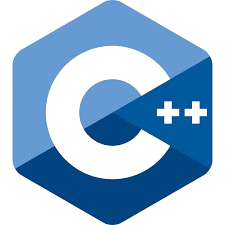
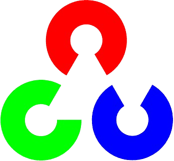
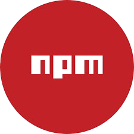
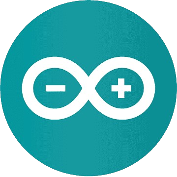
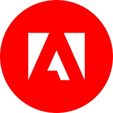

# Hello, I am Arnab 👋

<strong>Welcome to my GitHub profile :)</strong> 

  

 🔭 Exploring new technologies and frameworks like machine learning, cloud computing, and microservices, constantly challenging myself to apply them in real-world projects. 

<!--    -->

 🌟 Driven by creativity, I enjoy blending technology with problem-solving, always seeking innovative ways to push boundaries and explore new ideas. 

<!--    -->

 📚 B.Tech in Computer Science and Engineering from PES University, Bengaluru, India, with a strong foundation in algorithms, systems, and problem-solving. 

<!--    -->

 📈 Passionate about both computers and fitness, always pushing myself to excel in these areas and stay balanced. 

  

To touch upon some of my technical skills and the subjects that I'd look forward to having a discussion over a cup of coffee☕ on.....
  

### 💻 Languages I'm good at:

  
  
  
  
  
  
  
  
  
  
  
  
  

### 🧰 Libraries and Frameworks

  
  
  
  
  
  
  
  
  
  
  
  
  
  
  
  
  
  

### 🔧 Tools

  
  
  
  
  
  
  
  
  
  
  
  
  

### ☎️ Contact me

  
  
  

  

### 🏆 GitHub Stats

![cheesits456's GitHub Stats][github-stats-img]

<!-- Link anchors -->

[github-stats-img]: https://github-readme-stats.vercel.app/api?username=ArnabKarmakar1108&theme=vision-friendly-dark&show_icons=true&rank_icon=github&include_all_commits=true&count_private=true

## My Repos ⬇️
